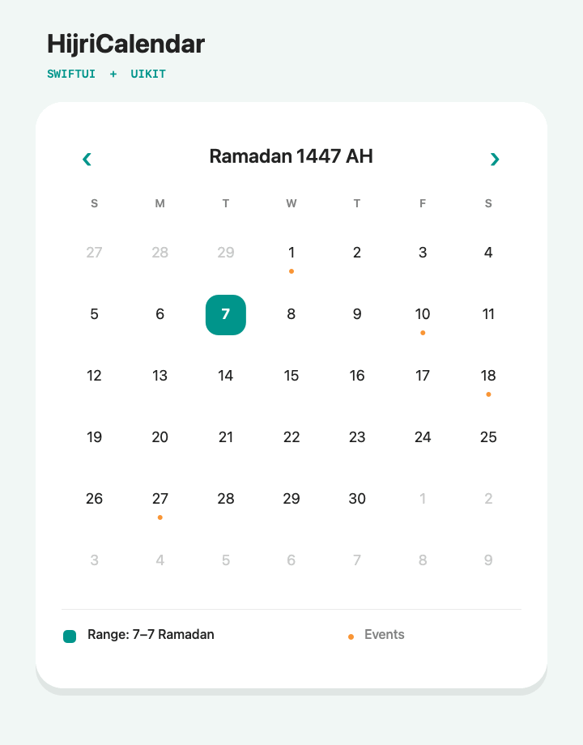

# HijriCalendar

A Swift Package for presenting and selecting Hijri dates in SwiftUI and UIKit. Both interfaces share the same calendar engine, calculation systems, selection rules, bounds, localization, and day decorations.



## Features

- SwiftUI and UIKit APIs backed by one renderer
- Umm al-Qura, Islamic, Civil, and Tabular calculations through Foundation
- Manual day adjustment and authority-published month-start overrides
- Single, multiple, range, and read-only selection modes
- Fixed six-week month grid with optional adjacent-month dates
- Minimum and maximum date limits
- Per-day colors, event dots, disabled dates, and accessibility labels
- Arabic and English localization, RTL layout, and configurable first weekday
- Dynamic Type, VoiceOver labels, swipe navigation, and programmatic navigation
- iOS 15+ and zero third-party dependencies

## Complete example apps

- [SwiftUI demo](Examples/SwiftUIDemo/SwiftUIDemo.xcodeproj) exercises bindings, modifiers, themes, language and direction overrides, calculation systems, official month starts, selection modes, bounds, events, and custom labels.
- [UIKit demo](Examples/UIKitDemo/UIKitDemo.xcodeproj) exercises delegates, data sources, appearance, runtime configuration, calculation systems, official month starts, Auto Layout, and programmatic navigation.

Each project resolves version `1.0.0` or later in the `1.x` series directly from this GitHub repository. Open either `.xcodeproj`, let Xcode resolve packages, and run it. See [Examples/README.md](Examples/README.md) for details.

## Installation

### Xcode

1. Open **File > Add Package Dependencies**.
2. Enter your repository URL:

   ```text
   https://github.com/ahmedshoeib/HijriCalendar-iOS.git
   ```

3. Choose **Up to Next Major Version** and select the product your app needs.

| App type | Product | Import |
| --- | --- | --- |
| Date conversion/model only | `HijriCalendar` | `import HijriCalendar` |
| UIKit | `HijriCalendarUIKit` | `import HijriCalendar` and `import HijriCalendarUIKit` |
| SwiftUI | `HijriCalendarSwiftUI` | `import HijriCalendar` and `import HijriCalendarSwiftUI` |

### Package.swift

Add the package dependency:

```swift
dependencies: [
    .package(
        url: "https://github.com/ahmedshoeib/HijriCalendar-iOS.git",
        from: "1.0.0"
    )
]
```

Then add the product needed by each target:

```swift
.target(
    name: "MySwiftUIApp",
    dependencies: [
        .product(name: "HijriCalendarSwiftUI", package: "hijricalendar-ios")
    ]
),
.target(
    name: "MyUIKitApp",
    dependencies: [
        .product(name: "HijriCalendarUIKit", package: "hijricalendar-ios")
    ]
),
.target(
    name: "MyDateService",
    dependencies: [
        .product(name: "HijriCalendar", package: "hijricalendar-ios")
    ]
)
```

For local development, drag this repository into an Xcode workspace or use:

```swift
.package(path: "../HijriCalendar")
```

## SwiftUI

### Single selection

```swift
import SwiftUI
import HijriCalendar
import HijriCalendarSwiftUI

struct BookingCalendar: View {
    @State private var selection: HijriCalendarSelection = .single(nil)
    @State private var month = HijriMonth(foundationDate: Date())

    var body: some View {
        HijriCalendarSwiftUI.HijriCalendar(
            selection: $selection,
            displayedMonth: $month,
            selectionMode: .single
        )
        .frame(height: 382)
    }
}
```

The module-qualified name above avoids ambiguity between the package module and the SwiftUI view. If your file only imports `HijriCalendarSwiftUI`, you can write `HijriCalendar(...)` directly.

### Selection modes

Initialize the binding with the matching value and pass the corresponding mode:

```swift
// No selection; useful as a read-only event calendar.
@State var readOnlySelection: HijriCalendarSelection = .none
// selectionMode: .none

// One optional date. Tapping the selected date clears it.
@State var singleSelection: HijriCalendarSelection = .single(nil)
// selectionMode: .single

// Any number of independently selected dates.
@State var multipleSelection: HijriCalendarSelection = .multiple([])
// selectionMode: .multiple

// First tap starts a range, second tap completes it, third tap starts again.
@State var rangeSelection: HijriCalendarSelection = .range(nil)
// selectionMode: .range
```

### Bounds and calendar behavior

```swift
let configuration = HijriCalendarConfiguration(
    calendarSystem: .ummAlQura,
    firstWeekday: 7, // Saturday; Foundation weekday values are 1...7.
    minimumDate: HijriDate(year: 1447, month: 9, day: 1),
    maximumDate: HijriDate(year: 1447, month: 10, day: 30),
    showsAdjacentMonthDates: false
)

HijriCalendarSwiftUI.HijriCalendar(
    selection: $selection,
    displayedMonth: $month,
    selectionMode: .range,
    configuration: configuration
)
.frame(height: 382)
```

### Styling, events, and disabled dates

```swift
HijriCalendarSwiftUI.HijriCalendar(
    selection: $selection,
    displayedMonth: $month,
    selectionMode: .multiple
)
.calendarStyle(HijriCalendarStyle(
    selection: .green,
    today: .green,
    event: .orange,
    dayCornerRadius: 10
))
.dayDecoration { date in
    if date.day == 1 {
        return HijriCalendarDayDecoration(
            event: .orange,
            accessibilityLabel: "First day of the Hijri month"
        )
    }
    if date.day == 15 {
        return HijriCalendarDayDecoration(text: .secondary, isEnabled: false)
    }
    return nil
}
.onDateTap { date in
    print("Tapped \(date)")
}
.frame(height: 382)
```

### Custom labels

```swift
.minimumDayLabelDigits(2) // Localized padding: 01 in English, ٠١ in Arabic.
.monthTitle { month in "Hijri \(month.month) / \(month.year)" }
.dayLabel { date in "D\(date.day)" } // Optional; overrides numeric day formatting.
.weekdaySymbols(["Su", "Mo", "Tu", "We", "Th", "Fr", "Sa"])
```

For a one-off label, return `HijriCalendarDayDecoration(label: "Eid")` from `dayDecoration`.

Use `HijriCalendarEngine(configuration: configuration).dateLabel(for: date)`
for a localized full date in status text, accessibility content, or selection summaries.

SwiftUI's `locale` and `timeZone` environment values are applied automatically:

```swift
.environment(\.locale, Locale(identifier: "ar_SA"))
.environment(\.timeZone, TimeZone(identifier: "Asia/Riyadh")!)
```

Arabic, Persian, Hebrew, and Urdu locales automatically use right-to-left navigation and layout.

The language and direction can also be changed at runtime without changing the whole app:

```swift
.calendarLocale(Locale(identifier: "ar_SA"))
.calendarTimeZone(TimeZone(identifier: "Asia/Riyadh")!)
.calendarSystem(.civil)
.calendarLayoutDirection(.automatic) // Or .leftToRight / .rightToLeft
```

In automatic mode, Arabic uses RTL and English uses LTR. A forced direction is useful for testing or mixed-language interfaces.

UIKit callers can change the same values at runtime:

```swift
var configuration = calendarView.configuration
configuration.locale = Locale(identifier: "ar_SA")
configuration.timeZone = TimeZone(identifier: "Asia/Riyadh")!
configuration.calendarSystem = .tabular
configuration.layoutDirection = .automatic
calendarView.configuration = configuration
```

## UIKit

### Programmatic setup

```swift
import UIKit
import HijriCalendar
import HijriCalendarUIKit

final class CalendarViewController: UIViewController {
    private let calendarView = HijriCalendarView()

    override func viewDidLoad() {
        super.viewDidLoad()

        calendarView.translatesAutoresizingMaskIntoConstraints = false
        calendarView.selectionMode = .range
        calendarView.selection = .range(nil)
        calendarView.configuration = HijriCalendarConfiguration(
            locale: Locale(identifier: "ar_SA"),
            timeZone: TimeZone(identifier: "Asia/Riyadh")!,
            calendarSystem: .ummAlQura,
            firstWeekday: 7
        )
        calendarView.delegate = self
        calendarView.dataSource = self

        view.addSubview(calendarView)
        NSLayoutConstraint.activate([
            calendarView.leadingAnchor.constraint(equalTo: view.layoutMarginsGuide.leadingAnchor),
            calendarView.trailingAnchor.constraint(equalTo: view.layoutMarginsGuide.trailingAnchor),
            calendarView.centerYAnchor.constraint(equalTo: view.centerYAnchor),
            calendarView.heightAnchor.constraint(equalToConstant: 382)
        ])
    }
}

extension CalendarViewController: HijriCalendarViewDelegate {
    func calendarView(
        _ calendarView: HijriCalendarView,
        didChangeSelection selection: HijriCalendarSelection
    ) {
        print(selection)
    }

    func calendarView(_ calendarView: HijriCalendarView, didTap date: HijriDate) {
        print("Tapped \(date)")
    }
}

extension CalendarViewController: HijriCalendarViewDataSource {
    func calendarView(
        _ calendarView: HijriCalendarView,
        decorationFor date: HijriDate
    ) -> HijriDayDecoration? {
        date.day == 1 ? HijriDayDecoration(eventColor: .systemOrange) : nil
    }
}
```

### Navigation and selection

```swift
calendarView.display(HijriMonth(year: 1447, month: 10), animated: true)
calendarView.displayToday()
calendarView.select(HijriDate(year: 1447, month: 10, day: 1))
calendarView.reloadData() // Refresh decorations after your event data changes.

calendarView.minimumDayLabelDigits = 2 // Localized padding: 01 in English, ٠١ in Arabic.
calendarView.monthTitleFormatter = { "Month \($0.month), \($0.year) AH" }
calendarView.dayFormatter = { "D\($0.day)" } // Optional; overrides numeric day formatting.
calendarView.customWeekdaySymbols = ["Su", "Mo", "Tu", "We", "Th", "Fr", "Sa"]
```

### Custom appearance

```swift
calendarView.appearance = HijriCalendarAppearance(
    backgroundColor: .secondarySystemBackground,
    selectionColor: .systemGreen,
    todayColor: .systemGreen,
    eventColor: .systemOrange,
    dayCornerRadius: 10
)
calendarView.showsNavigationButtons = false
```

## Date conversion

The core module can be used without either UI product:

```swift
import HijriCalendar

let calendar = Calendar.hijri(
    system: .civil,
    locale: Locale(identifier: "ar_SA"),
    timeZone: TimeZone(identifier: "Asia/Riyadh")!
)

let hijri = HijriDate(date: Date(), calendar: calendar)
let foundationDate = hijri.foundationDate(in: calendar)
let nextMonth = HijriMonth(date: hijri).advanced(by: 1, calendar: calendar)
```

### Choosing a calculation system

There is no single algorithmic Hijri calendar used everywhere. The religious calendar is tied to the beginning of the lunar month, while software needs deterministic rules that can calculate dates in advance. Different rules may therefore map the same Gregorian day to different Hijri days.

The package exposes the four Islamic calendar identifiers provided by Foundation:

| System | How it works | Common product context | Choose it when |
| --- | --- | --- | --- |
| `.ummAlQura` | Uses the astronomy-based Umm al-Qura calculation. | Saudi Arabian government, business, and consumer experiences; systems already storing Umm al-Qura dates. | Your product targets Saudi Arabia or its data contract explicitly requires Umm al-Qura. This is the package default for compatibility. |
| `.islamic` | Uses Foundation's general Islamic calendar identifier without selecting the explicit Civil, Tabular, or Umm al-Qura variant. | Existing Apple-platform code or stored data that already uses `Calendar.Identifier.islamic`. | Compatibility with an existing `.islamic` implementation is more important than selecting a named arithmetic convention. Validate its output against your product's authority. |
| `.civil` | Uses a predictable arithmetic calendar with a fixed 30-year leap cycle and the Friday, or civil, epoch. | Calendar libraries, researchers, archives, and civil date systems that need dates calculable far in advance; this convention has historically appeared in a number of Arab-country civil contexts. | Your specification explicitly calls for the Islamic Civil calendar or a Friday-epoch tabular calculation. |
| `.tabular` | Uses a predictable arithmetic calendar with the Thursday, or astronomical, epoch. | Standards interoperability, academic or historical calculations, and systems that explicitly name the tabular Thursday-epoch convention. | Your specification explicitly calls for Apple's Islamic Tabular calendar. It can differ from `.civil` because the epoch convention is different. |

These map to `.islamicUmmAlQura`, `.islamic`, `.islamicCivil`, and `.islamicTabular` respectively. See [Apple's `Calendar.Identifier` documentation](https://developer.apple.com/documentation/foundation/calendar/identifier-swift.enum) and [Unicode's Islamic calendar type notes](https://cldr.unicode.org/development/development-process/design-proposals/islamic-calendar-types) for the underlying distinctions.

#### Important usage notes

- A calculation system is independent from language, number formatting, time zone, first weekday, and LTR/RTL layout. For example, an English interface can use Umm al-Qura and an Arabic interface can use Civil.
- Calculated dates do not necessarily replace a local moon-sighting declaration. For religious observance, legal deadlines, or official announcements, use the calendar system and date source required by the relevant authority.
- A `HijriDate` stores only year, month, and day components. Persist the accompanying `HijriCalendarSystem`, or store the absolute `Date`, whenever the calculation system might not be obvious.
- Minimum and maximum `HijriDate` values are interpreted using the configuration's current system. The example apps clear their selection and return to today when the system changes so dates are not silently reinterpreted.

### Official month starts and country adjustments

Local religious or government authorities can declare a month start that differs from the selected calculation. `HijriCalendarConfiguration` supports two correction levels:

| Option | Intended use | Behavior |
| --- | --- | --- |
| `dayAdjustment` | A simple product- or country-wide difference when no official monthly feed is available. | Accepts `-2...2`; positive values display a later Hijri day and values outside the range are clamped. |
| `monthStartOverrides` | Exact Gregorian starts published by a trusted moon-sighting or government authority. | Anchors the named Hijri month and propagates the authority timeline until another published start replaces it. |

The precedence is official month-start overrides, then manual day adjustment, then the selected calculation system. Once at least one official anchor is present, that authority timeline takes precedence over `dayAdjustment` so the calendar cannot duplicate or skip dates at a month boundary.

Use a manual adjustment when your product requirements say that a jurisdiction is consistently one day ahead or behind its calculated calendar:

```swift
let configuration = HijriCalendarConfiguration(
    calendarSystem: .ummAlQura,
    dayAdjustment: 1 // Today displays as the next calculated Hijri day.
)
```

Apply an authority-published start after receiving it from your app's trusted data source:

```swift
func configuration(
    applying officialStartDate: Date
) -> HijriCalendarConfiguration {
    var configuration = HijriCalendarConfiguration(
        timeZone: TimeZone(identifier: "Asia/Dubai")!,
        calendarSystem: .ummAlQura
    )
    configuration.setMonthStartOverride(
        officialStartDate,
        for: HijriMonth(year: 1448, month: 9)
    )
    return configuration
}
```

For a downloaded or persisted schedule, initialize all known starts together:

```swift
let configuration = HijriCalendarConfiguration(
    calendarSystem: .ummAlQura,
    monthStartOverrides: [
        HijriMonthStartOverride(
            month: HijriMonth(year: 1448, month: 9),
            gregorianStartDate: ramadanStart
        ),
        HijriMonthStartOverride(
            month: HijriMonth(year: 1448, month: 10),
            gregorianStartDate: shawwalStart
        )
    ]
)
```

Consecutive official starts determine whether the intervening month has 29 or 30 days. The array is sorted internally, but its published dates must progress chronologically by Hijri month and every interval must be valid. Duplicate month entries are allowed, with the last entry taking effect. Before the earliest override, the earliest anchor is projected backward using the selected calculation's month lengths; after an override, it is projected forward until the next exact anchor.

When corrections matter, use the configuration conversion methods so both directions follow the same rules:

```swift
let hijriToday = configuration.hijriDate(from: Date())
let gregorianDay = configuration.foundationDate(from: hijriToday)
```

The lower-level `HijriDate(date:calendar:)` and `foundationDate(in:)` APIs use only the Foundation calculation and do not apply configuration corrections.

The package deliberately performs no networking and does not guess an authority from a country or locale. The host app should fetch, verify, cache, and persist data from its chosen authority, including the calendar system, time zone, manual adjustment, and official starts. Overrides use the Gregorian civil day in the configuration's time zone and change at midnight; sunset-based religious-day presentation is outside the current scope.

To preserve the same point in time while converting between systems, resolve with the source calendar and then read the result with the destination calendar:

```swift
let source = Calendar.hijri(system: .ummAlQura)
let destination = Calendar.hijri(system: .civil)

let ummAlQuraDate = HijriDate(year: 1448, month: 4, day: 1)
let instant = ummAlQuraDate.foundationDate(in: source)
let civilDate = instant.map { HijriDate(date: $0, calendar: destination) }
```

`HijriDate` is `Hashable`, `Codable`, `Comparable`, and `Sendable`, making it suitable for persistence, sets, ranges, and concurrency boundaries.

## Architecture

```text
HijriCalendar          Foundation-only date engine and selection model
        |
HijriCalendarUIKit     UICollectionView renderer, delegates, decorations
        |
HijriCalendarSwiftUI   UIViewRepresentable, bindings, SwiftUI colors
```

The SwiftUI component wraps the UIKit renderer intentionally. This keeps selection behavior, accessibility, RTL layout, and visual output identical instead of maintaining two calendar implementations.

## Requirements

- iOS 15+
- Swift 5 language mode or newer toolchain
- Xcode 16+ recommended

Foundation supplies all four calculations. Their exact supported conversion ranges can vary with the operating system; validate dates at your product's range boundaries if your app handles historical or far-future dates.

## Tests

The unit suite covers every supported calendar system, known Umm al-Qura conversion, cross-system round trips and grids, manual adjustment, official-start round trips, 29/30-day authority months, legacy and current Codable configurations, sorting, month/year boundaries, consecutive dates, bounds, weekday ordering, mutable configuration, localization, automatic and forced LTR/RTL direction, and every selection-mode transition.

```bash
swift test
```

## License

HijriCalendar is available under the MIT License. See [LICENSE](LICENSE).
